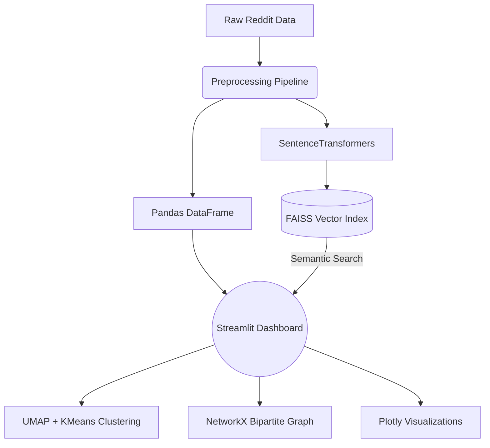
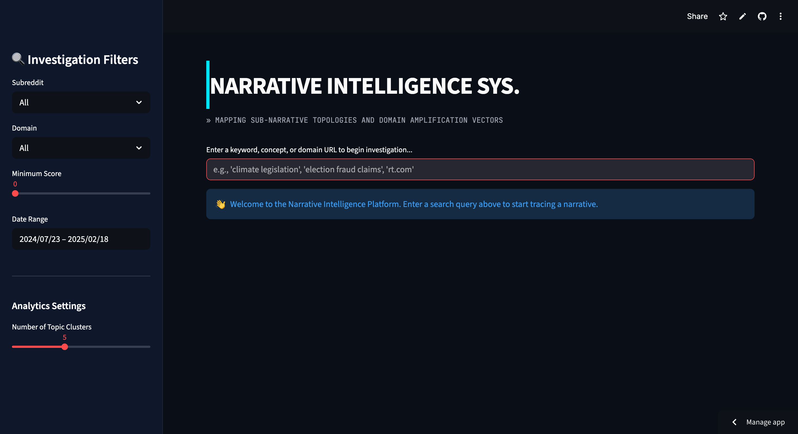
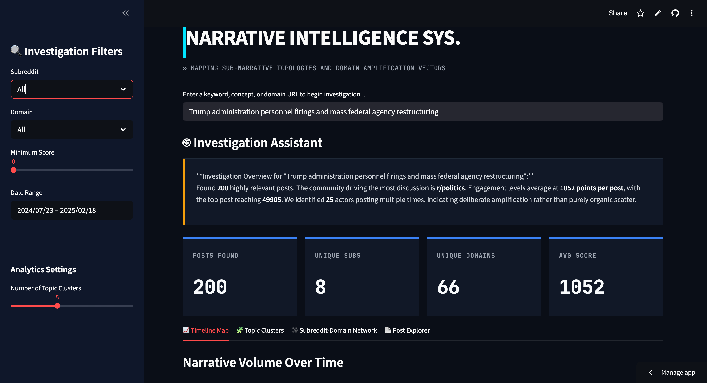
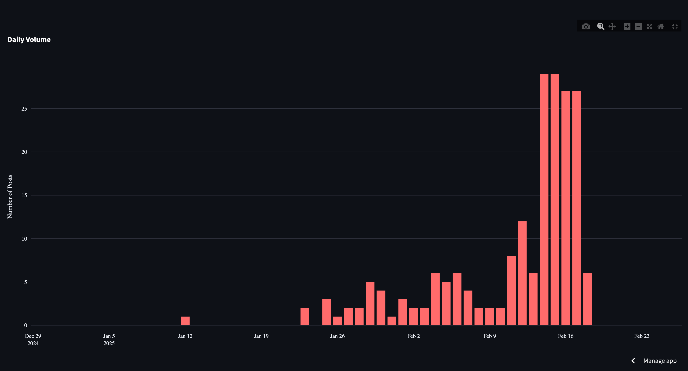
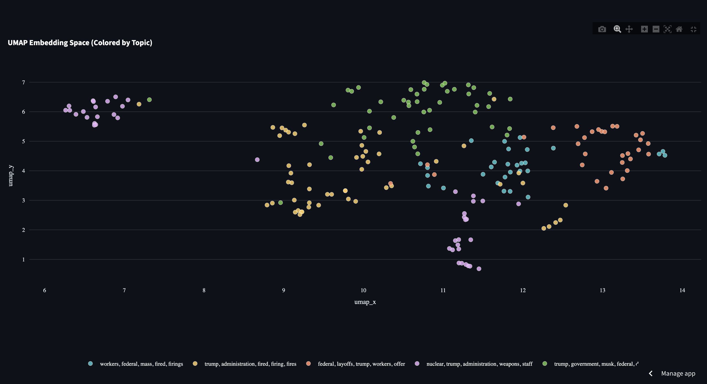
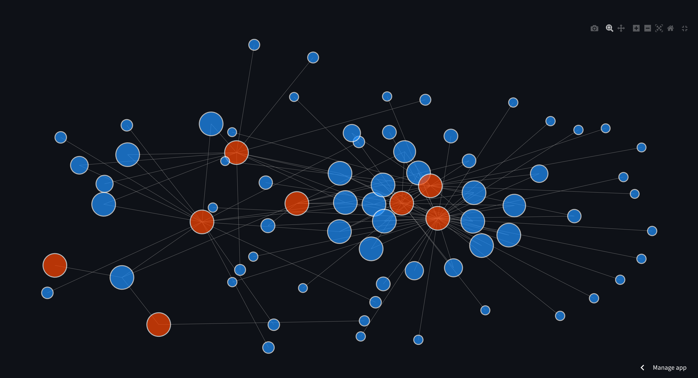
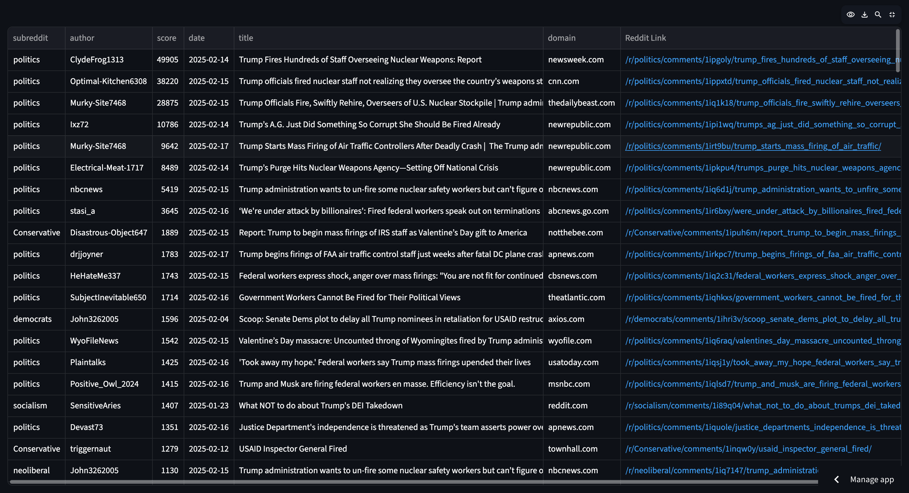
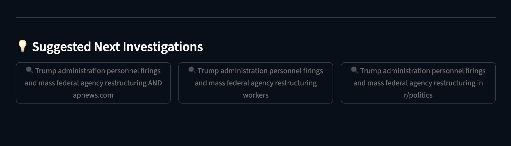

<div align="center">
  <h1>🔍 Reddit Narrative Intelligence</h1>
  <p><strong>Investigate topic propagation, domain amplification, and narrative structures across Reddit communities.</strong></p>

  [](https://reddit-narrative-intelligence.streamlit.app/)
  []()
  []()
</div>

---

## 🌐 Live Demo
The application is officially deployed and publicly accessible. 
**[Access the Live Investigation Dashboard here](https://reddit-narrative-intelligence.streamlit.app/)**

---

## 📖 Project Overview
The **Reddit Narrative Intelligence Platform** is an interactive, production-ready Open Source Intelligence (OSINT) dashboard. It enables researchers, trust & safety analysts, and journalists to track how specific concepts, keywords, and URLs organically propagate across diverse Reddit communities. 

Unlike generic social listening tools that rely on rigid keyword matching, this tool uses **semantic embedding spaces** to capture the underlying meaning of narratives. It bridges the gap between massive unstructured text datasets and structured, actionable investigative insights.

---

## ✨ Key Features
- **Semantic Narrative Search:** Retrieve high-relevance posts using dense vector embeddings (FAISS + SentenceTransformers), bypassing strict boolean limitations.
- **Time-Series Trend Analysis:** Interactive volumetric tracking to pinpoint when a narrative peaked or began its lifecycle.
- **Deterministic Summarization:** Rule-based, context-aware generation of insights that summarize the current retrieved data state without hallucination.
- **Topic Clustering:** Dynamic, heavily tunable k-means groupings to expose sub-narratives and isolated talking points.
- **Interactive Embedding Visualization:** A UMAP-dimension-reduced scatter plot allowing analysts to hover over the exact semantic topography of the conversation.
- **Bipartite Amplifier Network Graph:** PageRank-driven graph visualizations highlighting the specific out-bound links (domains) being amplified by specific subreddits.
- **Post Explorer:** Deep-dive data grid for sorting, filtering, and directly accessing original Reddit sources.
- **Automated Investigation Prompts:** Evidence-driven suggestions dynamically created based on current cluster traits to guide the analyst's next semantic search.
- **Edge-Case Resilience:** Elegant fallbacks for sparse queries, un-clusterable topologies, and disconnected network topologies.

---

## 🕵️‍♂️ Investigative Workflow
The system is built to facilitate a seamless analyst journey:
1. **Query Entry:** The analyst provides a broad conceptual term or specific URL domain.
2. **Semantic Retrieval:** The system retrieves the top $N$ most conceptually aligned posts.
3. **Trend Evolution:** The analyst inspects daily volume spikes to establish temporal context.
4. **Sub-Topic Identification:** The analyst uses the interactive UMAP map and cluster matrix to identify distinct angles of the narrative.
5. **Amplifier Mapping:** The bipartite structural graph reveals if certain communities are coordinating around specific external links.
6. **Ground-Truth Verification:** The analyst directly audits the raw posts.
7. **Iterative Pivot:** The analyst follows system-suggested queries to drill deeper into a discovered sub-topic.

---

## 🏗️ Architecture



---

## 🛠️ Tech Stack

| Component | Technology | Purpose |
| :--- | :--- | :--- |
| **Frontend/Framework** | Streamlit | Rapid, interactive data application UI |
| **Vector Retrieval** | FAISS + SentenceTransformers | Highly efficient semantic similarity search |
| **Data Processing** | Pandas, PyArrow | Fast, memory-efficient columnar data manipulation |
| **Clustering Algorithms** | scikit-learn (KMeans) | Dynamic topic grouping |
| **Dimensionality Reduction** | UMAP | Mapping high-dimensional embeddings to 2D UI space |
| **Graph Network Analysis**| NetworkX | Calculating Bipartite Topology and PageRank |
| **Interactive Plotting** | Plotly | Rich, hover-enabled interactive charting |

---

## 🗂️ Repository Structure

```text
research-engineering-intern-assignment/
├── app.py                      # Main Streamlit dashboard application
├── requirements.txt            # Production dependencies
├── .gitignore                  
├── README.md                   
├── data/
│   ├── raw/                    # Raw input JSON/CSV datasets
│   ├── processed/              # Cleaned Parquet files
│   └── artifacts/              # Generated FAISS indices and Numpy embeddings
├── scripts/
│   ├── preprocess.py           # Pipeline script: Clean text, handle missing fields
│   └── build_artifacts.py      # Pipeline script: Generate embeddings & FAISS index
└── src/
    ├── config.py               # Shared path routing and tuning parameters
    ├── data_loader.py          # Cached data ingress for high-performance UI
    ├── retrieval.py            # Top-K FAISS vector retrieval logic
    ├── clustering.py           # UMAP projection + KMeans sub-topic mapping
    ├── graph_analysis.py       # NetworkX bipartite logic (Subreddit ↔ Domain)
    ├── summaries.py            # Deterministic natural language insight generation
    └── related_queries.py      # Follow-up investigation path generation
```

---

## 🚀 Setup & Execution 

### 1. Environment Setup
```bash
# Clone the repository
git clone https://github.com/your-username/research-engineering-intern-assignment.git
cd research-engineering-intern-assignment

# Create and activate a virtual environment
python -m venv venv
source venv/bin/activate  # On Windows: venv\Scripts\activate

# Install dependencies (includes torchvision for Streamlit patching)
pip install -r requirements.txt
```

### 2. Artifact Generation
*(Requires placing the raw source dataset inside `data/raw/`)*
```bash
# Clean missing data, unify text, and convert to optimized Parquet
python scripts/preprocess.py

# Generate NLP embeddings and build the FAISS index
python scripts/build_artifacts.py
```

### 3. Run Locally
```bash
# Boot the Streamlit server
streamlit run app.py
```

---

## 📸 Screenshots

### Landing Page

*Initial view prompting the analyst to input their investigative query.*

### Search Results Overview

*Top-level investigation summary including total posts, unique domains, and conceptual summaries.*

### Time-Series Trend Analysis

*Volumetric bar charts mapping narrative peaks over time.*

### Topic Clustering & Embedding Map

*UMAP dimension reduction combined with KMeans clustering to map semantic topographies.*

### Bipartite Amplifier Network

*NetworkX PageRank mappings demonstrating which subreddits amplify which specific external domains.*

### Post Explorer

*Data matrix for verifying ground-truth raw posts.*

### Suggested Follow-up Investigations

*Evidence-driven prompt buttons to seamlessly pivot the investigation.*

---

## 🎯 Semantic Search Validation

A core feature of this platform is the transition from boolean keyword filtering to **Semantic Vector Search**. Below are empirical examples of the system retrieving contextually accurate information without exact string matching.

| Analyst Query | Example Retrieved Result | Why It Is Correct |
| :--- | :--- | :--- |
| *"Immigration enforcement pushback and resistance"* | *"Sunnyvale speaker urges council to protect immigrants from ICE arrests"* | The system maps "resistance" to "protect" and "enforcement" to "ICE arrests" based on semantic closeness, unearthing localized political action. |
| *"Federal agency restructuring and mass firings"* | *"USAID Inspector General Fired"* | Neither "USAID" nor "Inspector General" were explicitly requested, but the model conceptually maps the event to the broader theme of federal restructuring. |
| *"Border security, fentanyl, and international trade"* | *"Blinken’s Warning: U.S. ‘Losing Faith’ in Canada’s Ability to Combat Industrial-Scale Fentanyl"* | Captures high-level geopolitical analysis of border narcotics without needing exact string matches for diplomats or specific illicit substances. |

---

## 🧠 ML / AI Component Summary

| Component | Model / Algorithm | Key Parameters | Library / API Used |
| :--- | :--- | :--- | :--- |
| **Semantic Embedding** | `all-MiniLM-L6-v2` | Max Length: 256, Output Dim: 384 | `sentence-transformers` |
| **Vector Search** | IndexFlatL2 | K=200 | `faiss-cpu` |
| **Clustering** | KMeans | `n_clusters` (UI Tunable: 2->10) | `scikit-learn` |
| **Embedding Projection**| UMAP | `n_components=2`, `metric='cosine'` | `umap-learn` |
| **Graph Centrality** | PageRank | Directed Bipartite Map | `networkx` |

---

## ⚙️ Design Decisions
* **Use of Streamlit**: Prioritizes rapid UI iteration and Python-native logic, allowing an intensive data-science backend to quickly translate into front-end deliverables without managing a heavy React/Node repository.
* **Semantic Search vs. Keyword**: Analysts frequently miss critical OSINT data because targets use evolving slang or synonyms. Sub-word embeddings counteract this evasion natively.
* **Tunable KMeans Matrix**: Hard-coding cluster numbers universally fails for distinct datasets. Allowing the analyst to use a UI slider to adjust `k` respects the analyst's investigative intuition.
* **Deterministic Summarizations**: Instead of wiring raw context into an unpredictable and costly LLM layer (which risks hallucination in an OSINT environment), summaries are generated computationally and deterministically via Python logic referencing live DataFrame states.
* **Bipartite Topology Layering**: Representing `Author -> Post` is often noisy. Grouping strictly by `Subreddit -> External Domain` strips noise and directly exposes platform-level coordination and amplification strategies.

---

## 🛡️ Robustness & Edge Cases
* **Invalid/Empty Queries**: Catches whitespace-only or punctuation-only ("< / >") queries, terminating cleanly before FAISS execution.
* **Sparse Results (< K)**: Gracefully modifies the UMAP component neighbors parameter dynamically to prevent projection crashes when retrieved pools are extremely small.
* **Network Isolation**: When discussions occur entirely on-platform (no external links), the system bypasses graph layout crashes and outputs a clean fallback message.
* **Non-English Tokens**: Supported implicitly by the robust sub-word tokenizer embedded within the SentenceTransformers model.

---

## 🔭 Future Improvements
1. **Cross-Platform Extensibility:** Decoupling the data-ingestion pipeline to support schema parity with specialized platforms like Telegram or X/Twitter.
2. **Temporal Event Alignment:** Injecting GDELT or external news APIs to plot major real-world events over the time-series charts to determine cause-and-effect spread.
3. **Analyst Exports:** Enabling 1-click generation of PDF intelligence reports mirroring the dashboard's current state.
4. **Cross-Encoder Reranking:** Adding a slower but highly-accurate secondary ranking pass purely on the top 100 documents isolated by FAISS.

---

## 📝 Submission Notes
This application design heavily focuses on **human-interpretable OSINT workflows** necessary for research engineering. It prioritizes data integrity and deterministic robustness over fragile AI wrappers. By enabling analysts to directly manipulate clustering dimensions, observe unaltered embedding space topologies, and easily verify original source data, the platform ensures that its algorithmic intelligence supports—rather than overrides—human investigative judgment.